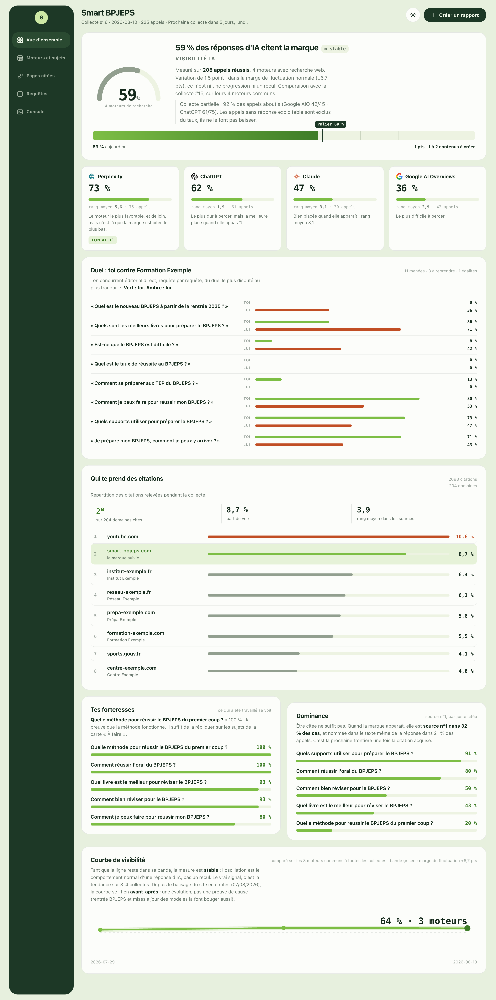

# Tracker GEO

Un outil de mesure de la visibilité d'une marque dans les réponses des IA génératives : ChatGPT, Claude, Perplexity et Google AI Overviews. Construit et utilisé sur mes propres sites.

**Stack** : Python · GitHub Actions (collecte automatique tous les lundis) · SQLite · APIs Anthropic, OpenAI, Perplexity et DataForSEO.

**Série en cours** : démarrée le 29 juillet 2026, collecte hebdomadaire automatique. Ce qui a de la valeur ici n'est pas l'outil, c'est la durée : la courbe se construit une semaine à la fois.



## Le problème

Le SEO suit des **positions** sur des mots-clés. Le GEO suit des **citations** sur des prompts.

Une position Google est stable : tu la regardes une fois, tu as ta réponse. Une réponse de LLM est non déterministe : pose la même question trois fois, tu peux être citée une fois sur trois. On ne peut donc pas **constater** une visibilité IA, on peut seulement **l'échantillonner**.

Cet outil transforme quelque chose d'instable en métrique : un taux de citation sur N répétitions × M moteurs, rejoué à intervalle fixe.

## Ce qu'il mesure

Pour chaque réponse, trois choses seulement :

1. la marque est-elle **citée** ?
2. à quel **rang** dans la réponse (en source, et en position dans le texte) ?
3. quelles **sources** sont citées, donc **qui prend la place** ?

Puis on agrège en taux, et on rejoue chaque semaine pour obtenir une courbe.

> Être cité ne suffit pas : il faut être en position dominante ET sur les bons sujets.
> C'est pour ça que le rang et les domaines concurrents sont stockés à chaque réponse, et pas seulement le fait d'être cité.

## Moteurs

| Moteur | Ce qu'on interroge | Fidélité au produit grand public |
|---|---|---|
| `anthropic` | Claude + recherche web | proche |
| `anthropic-memory` | Claude **sans** recherche | mesure la « mémoire de marque » |
| `openai` | ChatGPT + recherche web | proche |
| `perplexity` | API sonar | proche |
| `ai_overview` | Google AI Overviews via DataForSEO | **exacte** (vraie SERP) |

Le mode `anthropic-memory` interroge le modèle **sans recherche web**. Il ne mesure donc pas ce que le modèle trouve, mais ce qu'il sait : la marque est-elle connue sans aller la chercher ? C'est l'indicateur le plus lent à bouger de tous ceux suivis ici.

## Les deux garde-fous

**La marge de fluctuation.** Un taux de citation calculé sur un échantillon a une marge d'erreur. Elle est calculée à 95 % (`_marge()`, dans `dashboard_donnees.py`) et l'outil **refuse d'appeler « progression » un mouvement qui tient dedans** : il l'écrit à l'écran, en toutes lettres.

> *« Variation de 5,2 pts : dans la marge de fluctuation normale (±6,7 pts), ce n'est ni une progression ni un recul. »*


**La comparabilité de périmètre.** Deux collectes ne se comparent que si elles portent sur les **mêmes moteurs** et les **mêmes requêtes**. Quand ce n'est pas le cas, la collecte est écartée du calcul et le rapport le dit, plutôt que de produire un écart qui ne veut rien dire. Même logique pour les appels en échec : ils sont **exclus du taux** au lieu d'être comptés comme des non-citations, sinon une panne d'API ressemble à une chute de visibilité.

## Limite assumée

Les moteurs 1 à 4 interrogent des **modèles via API**, pas les **interfaces** grand public. Les écarts viennent du system prompt du produit, de la personnalisation et du routage. Cet écart existe, donc il est calibré : **une requête témoin par mois, posée à la main dans la vraie interface**, et l'écart consigné dans le journal.

## Installation

```bash
python3 -m venv .venv && source .venv/bin/activate
pip install -r requirements.txt
```

## Clés

**Il n'y a pas de `.env` dans ce dépôt, et il ne faut pas en créer.** Les clés vivent dans un trousseau unique, commun à tous les projets, situé **hors de ce dépôt** : elles ne peuvent donc pas être commitées ici par accident.

| Variable | Où l'obtenir |
|---|---|
| `ANTHROPIC_API_KEY` | console.anthropic.com (facturation séparée de l'abonnement Claude) |
| `OPENAI_API_KEY` | platform.openai.com |
| `PERPLEXITY_API_KEY` | perplexity.ai > Settings > API |
| `DATAFORSEO_LOGIN` + `DATAFORSEO_PASSWORD` | dataforseo.com (un login et un mot de passe, pas une clé) |

Ordre de résolution : variables d'environnement déjà définies (les secrets GitHub Actions gagnent toujours) → `TROUSSEAU_PATH` si défini → le trousseau commun → un `.env` local en dernier recours. Une valeur encore marquée `<À FOURNIR…>` est ignorée, pas prise pour une vraie clé.

Pour le cron GitHub, les mêmes variables doivent être créées en **secrets du dépôt**.

## Usage

```bash
# Voir le plan sans rien appeler ni rien dépenser
python -m geotracker.run --dry-run

# Test à petite échelle avant de lancer le vrai run
python -m geotracker.run --engines perplexity --prompts 2 --repetitions 1

# Le run complet
python -m geotracker.run --client smart-bpjeps

# Lire les résultats
python -m geotracker.report            # dernier run vs précédent
python -m geotracker.report --serie    # la courbe
```

## Règles à ne pas casser

1. **On garde le brut.** Chaque réponse complète est stockée horodatée dans `data/runs.sqlite3`. Les agrégats se recalculent à volonté, une réponse perdue ne se rattrape pas : c'est pour ça que tout est conservé, et que les extractions sont rejouables sur l'existant.
2. **On ne change pas le modèle en cours de série.** Changer de modèle casse la comparabilité. Si c'est nécessaire, faire tourner l'ancien et le nouveau en parallèle un mois.
3. **Ajouter une requête est sans danger. En modifier ou en retirer une, non.** Passer par un nouveau `set_version` dans le YAML.

## Structure

```
config/clients/*.yaml   le jeu de suivi (requêtes, concurrents, moteurs) — un fichier par site
geotracker/engines/     un adaptateur par moteur, contrat commun, aucun ne casse le run
geotracker/extract.py   les 3 extractions — pur, rejouable sur le brut déjà stocké
geotracker/db.py        SQLite, commit par réponse
geotracker/report.py    agrégation, aucun stockage
data/runs.sqlite3       tout le brut, horodaté
```

Le schéma est multi-domaines dès le départ : un seul site suivi aujourd'hui, aucune migration à faire le jour où il y en a un deuxième.

## Ce que ce projet m'a appris

- **Une réponse d'IA n'est pas une position Google.** Elle bouge d'un appel à l'autre, donc un « cité / pas cité » ponctuel ne dit rien. Tout le reste découle de là.
- **Un écart n'est pas un résultat.** Tant qu'un mouvement tient dans la marge de fluctuation, ce n'est pas un mouvement. C'est la fonctionnalité que j'ai le plus retravaillée.
- **Comparer deux collectes qui n'ont pas le même périmètre produit des chiffres flatteurs et faux.** D'où le garde-fou : mieux vaut ne rien afficher qu'afficher une progression inventée.
- **Un appel qui échoue n'est pas une absence de citation.** Confondre les deux transforme une panne d'API en chute de visibilité.
- **Interroger une API n'est pas interroger le produit grand public.** D'où le calibrage manuel mensuel, plutôt que de faire comme si l'écart n'existait pas.
